# OPNsense Dual-WAN HA (Active/Standby)

Tài liệu này hướng dẫn cấu hình **2 đường WAN theo mô hình Active/Standby** trên OPNsense, sử dụng **Gateway Priority**, **Gateway Group**, **Default Gateway Switching**, **Hybrid Source NAT** và **Policy Based Routing (PBR)**.

Mục tiêu là ưu tiên WAN chính trong điều kiện bình thường và tự động chuyển traffic sang WAN dự phòng khi WAN chính mất kết nối.

> **Phạm vi tài liệu:** cấu hình nền tảng Dual-WAN HA, kiểm tra trạng thái hoạt động và hướng dẫn triển khai Gateway Failback Monitor theo file note đi kèm. Cron được quản lý trên OPNsense Web UI.

---

## 1. Mô hình triển khai

### 1.1. Topology

```text
                             Internet
                                |
                 +--------------+--------------+
                 |                             |
            Primary WAN                   Backup WAN
             OPT2 / vmx2                   WAN / vmx1
           61.14.236.2/29              103.141.177.33/24
           GW 61.14.236.1              GW 103.141.177.1
                 |                             |
                 +---------- OPNsense ---------+
                                |
                           OPT1 / vmx0
                          10.0.0.254/29
                                |
                         Upstream / T0
                          10.0.0.253
                                |
                         192.168.0.0/24
```

### 1.2. Network mapping

| Vai trò | OPNsense Interface | Device | IP | Gateway | Priority |
|---|---|---|---|---|---:|
| Transit/Internal | OPT1 | `vmx0` | `10.0.0.254/29` | `10.0.0.253` dùng cho route ngược | 255 |
| WAN Backup | WAN | `vmx1` | `103.141.177.33/24` | `103.141.177.1` | 20 |
| WAN Primary | OPT2 | `vmx2` | `61.14.236.2/29` | `61.14.236.1` | 10 |

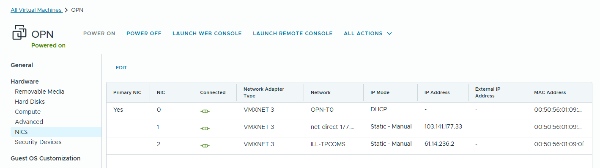

### 1.3. Kiểm tra interface trên OPNsense

Sau khi assign interface, console hiển thị:

```text
OPT1 (vmx0) -> 10.0.0.254/29
OPT2 (vmx2) -> 61.14.236.2/29
WAN  (vmx1) -> 103.141.177.33/24
```

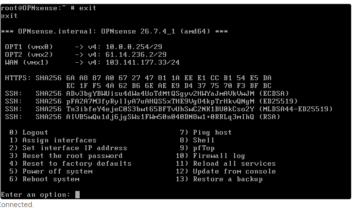

Kiểm tra tại **Interfaces → Assignments**:

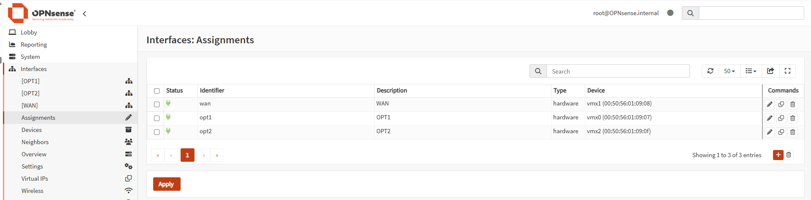

---

## 2. Chuẩn hóa Gateway

Đi tới **System → Gateways → Configuration**.

Cấu hình 2 Internet Gateway theo thứ tự ưu tiên:

| Gateway | Interface | Gateway IP | Monitor IP | Priority | Vai trò |
|---|---|---|---|---:|---|
| `OPT2_GW` | OPT2 | `61.14.236.1` | `61.14.236.1` | 10 | Primary |
| `WAN_GW` | WAN | `103.141.177.1` | `103.141.177.1` | 20 | Backup |

> **Lưu ý về Monitor IP:** trong cấu hình hiện tại, Monitor IP được đặt bằng chính IP gateway của từng WAN. Cách này kiểm tra được khả năng reach **next-hop gateway** của ISP, nhưng không kiểm tra đầy đủ khả năng truy cập Internet phía sau ISP. Nếu cần health-check end-to-end, có thể cân nhắc dùng một IP Internet ổn định riêng cho từng WAN.

### 2.1. Primary Gateway - OPT2_GW

```text
Name             : OPT2_GW
Interface        : OPT2
Address Family   : IPv4
Priority         : 10
IP Address       : 61.14.236.1
Upstream Gateway : Enabled
Monitor IP       : 61.14.236.1
```

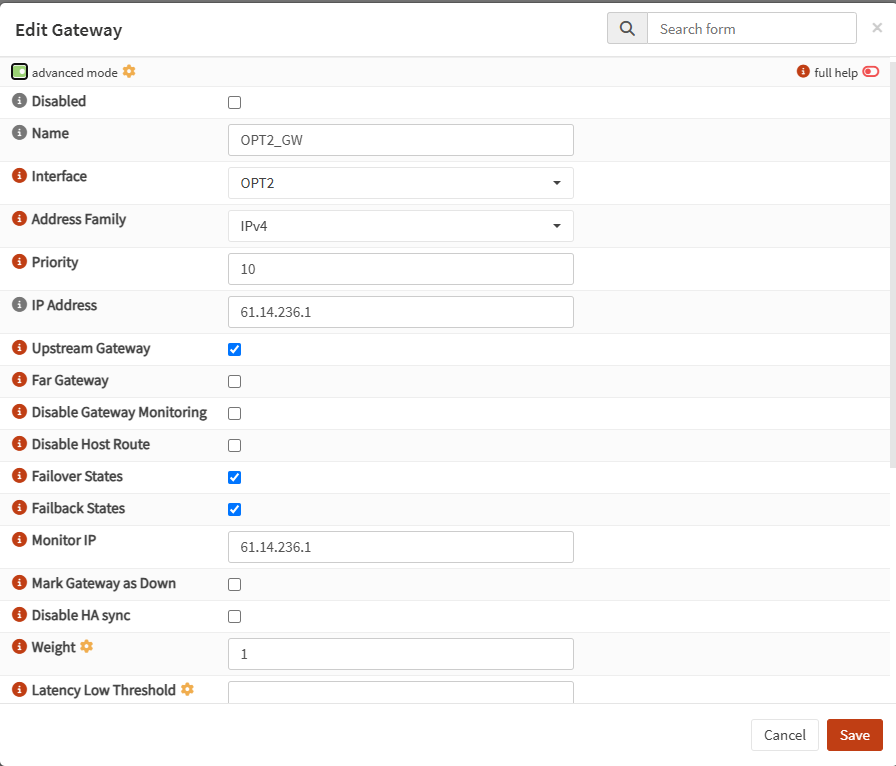

Advanced monitoring:

```text
Packet Loss Low Threshold  : 10
Packet Loss High Threshold : 20
Probe Interval             : 1
Time Period                : 15
Loss Interval              : 3
Weight                     : 1
```

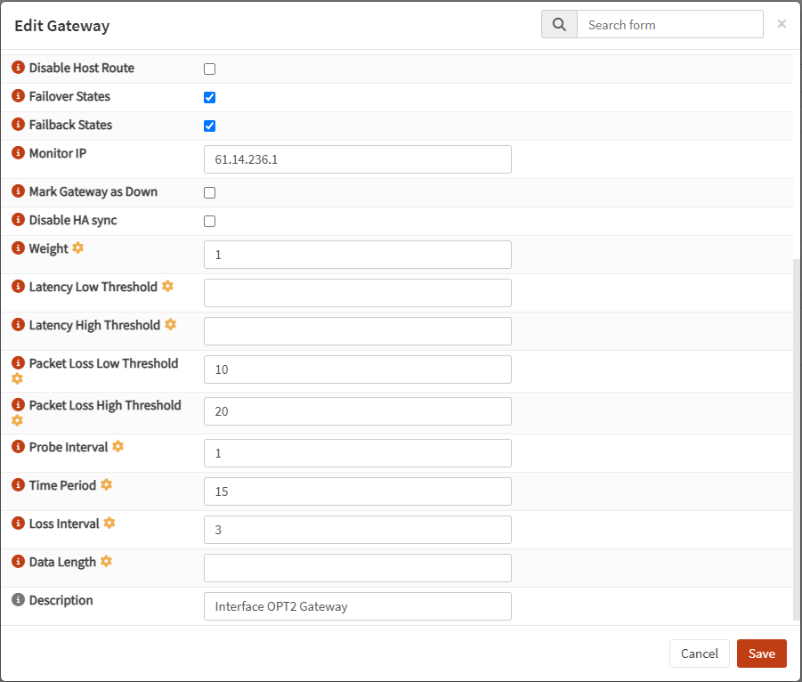

### 2.2. Backup Gateway - WAN_GW

```text
Name             : WAN_GW
Interface        : WAN
Address Family   : IPv4
Priority         : 20
IP Address       : 103.141.177.1
Upstream Gateway : Enabled
Monitor IP       : 103.141.177.1
```

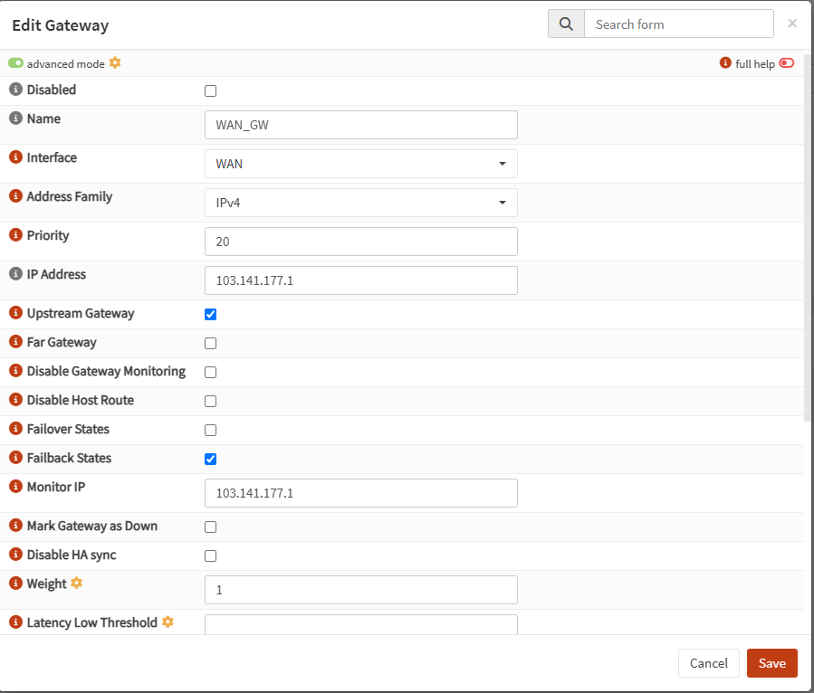

Advanced monitoring:

```text
Packet Loss Low Threshold  : 10
Packet Loss High Threshold : 20
Probe Interval             : 1
Time Period                : 15
Loss Interval              : 3
Weight                     : 1
```

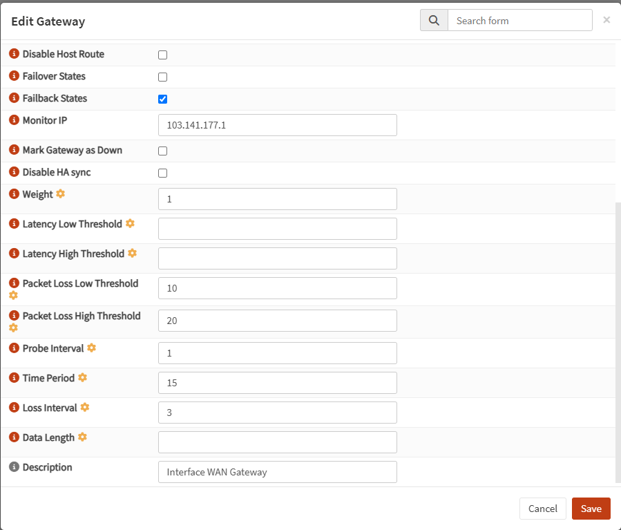

### 2.3. Kiểm tra tổng thể Gateway

Khi cả hai WAN hoạt động bình thường:

- `OPT2_GW` có Priority thấp hơn và là gateway chính.
- `WAN_GW` là gateway dự phòng.
- Hai gateway ở trạng thái Online.

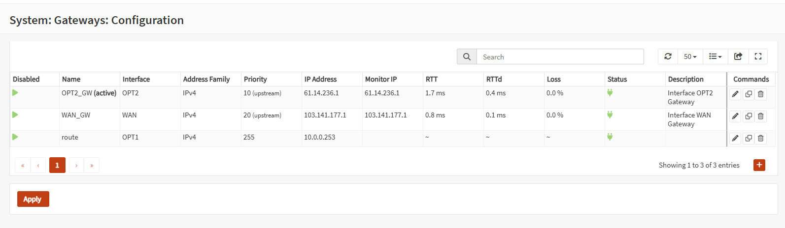

---

## 3. Kiểm tra Routing Table

Đi tới **System → Routes → Status**.

Trong trạng thái bình thường, default route phải đi qua WAN chính:

```text
default -> 61.14.236.1 -> vmx2 / OPT2
```

Ngoài ra hệ thống cần route ngược về mạng workload:

```text
192.168.0.0/24 -> 10.0.0.253 -> vmx0 / OPT1
```

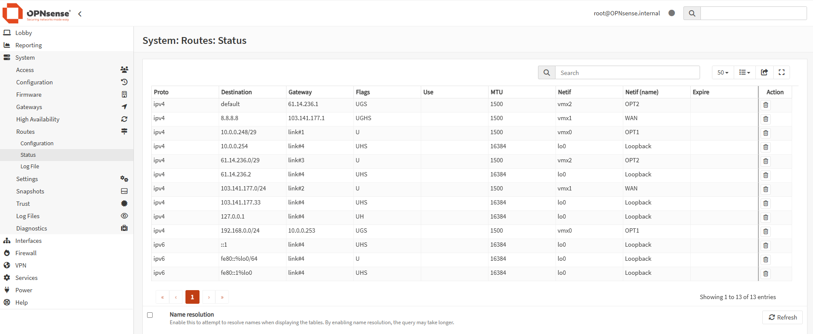

Có thể kiểm tra nhanh từ shell:

```sh
netstat -rn4 | grep default
```

Kỳ vọng:

```text
default    61.14.236.1    UGS    vmx2
```

---

## 4. Bật Default Gateway Switching

Đi tới **System → Settings → General**.

Bật:

```text
Allow default gateway switching
```

Sau đó **Save**.

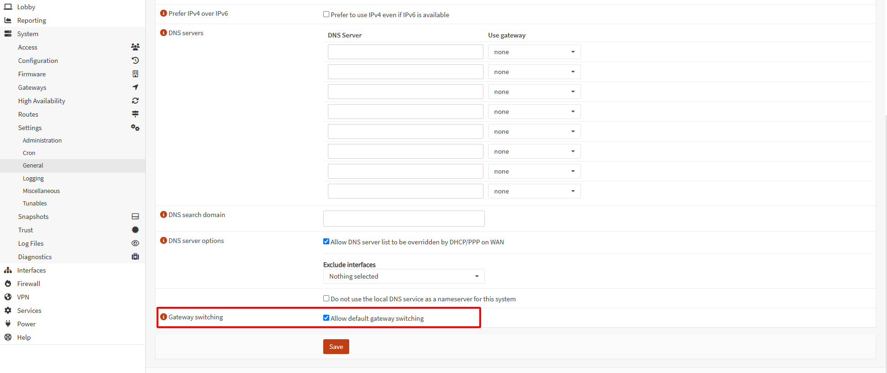

Setting này cho phép OPNsense thay đổi system default gateway khi gateway đang được ưu tiên không còn usable.

---

## 5. Tạo Gateway Group

Đi tới **System → Gateways → Group**.

Tạo Gateway Group:

```text
Name          : GW_WAN_FAILOVER
Tier 1        : OPT2_GW - 61.14.236.1
Tier 2        : WAN_GW  - 103.141.177.1
Trigger Level : Packet Loss
Pool Options  : Default
```

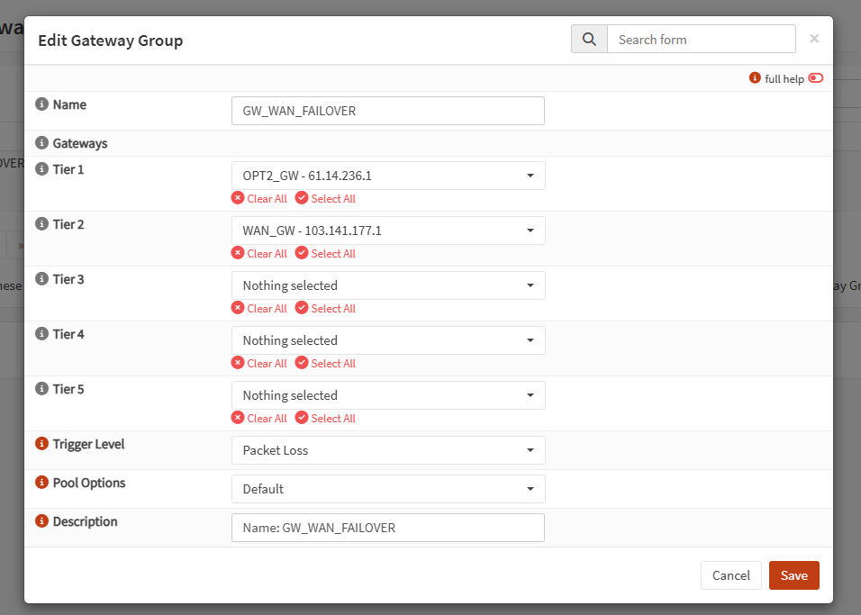

### Logic hoạt động

```text
Normal:
OPT2_GW Tier 1
    |
    +--> traffic đi Primary WAN

Primary unavailable:
OPT2_GW không usable
    |
    +--> WAN_GW Tier 2
         |
         +--> traffic đi Backup WAN
```

> Gateway Group chỉ có tác dụng với traffic khi được tham chiếu trong firewall rule hoặc policy-based routing rule.

---

## 6. Cấu hình Source NAT cho cả 2 WAN

Đi tới **Firewall → NAT → Source NAT**.

Chọn mode:

```text
Hybrid Source NAT rule generation
```

Không sử dụng Automatic-only mode vì mạng `192.168.0.0/24` nằm phía sau OPT1/upstream routing và cần SNAT riêng trên từng WAN.

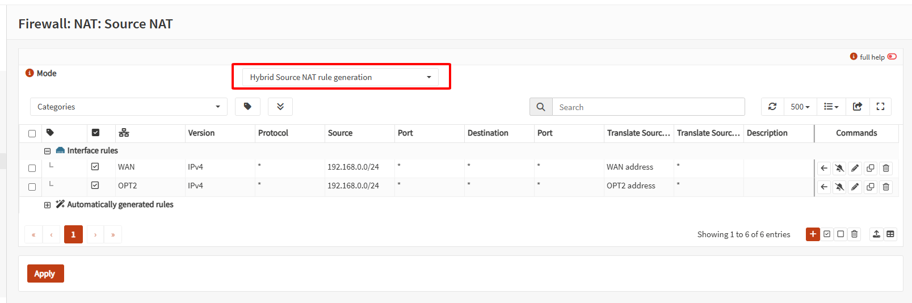

### 6.1. Source NAT cho Backup WAN

```text
Interface            : WAN
Version              : IPv4
Protocol             : any
Source Address       : 192.168.0.0/24
Destination          : any
Translate Source IP  : WAN address
Translate Source Port: any
```

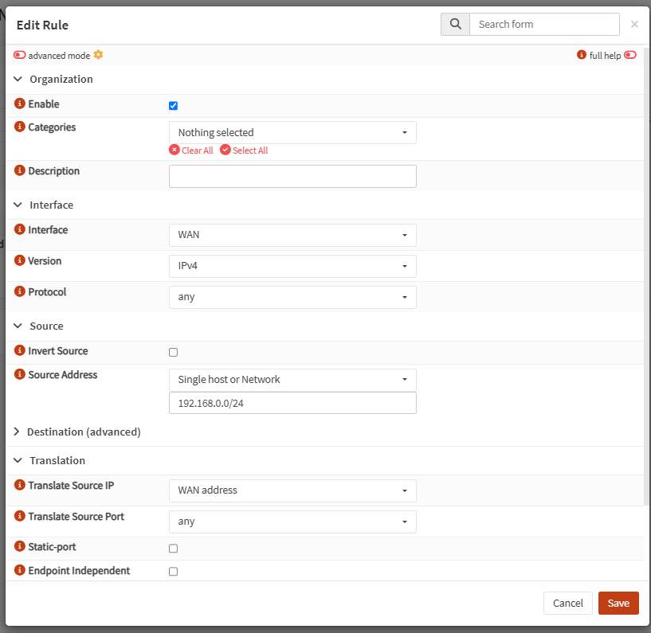

### 6.2. Source NAT cho Primary WAN

```text
Interface            : OPT2
Version              : IPv4
Protocol             : any
Source Address       : 192.168.0.0/24
Destination          : any
Translate Source IP  : OPT2 address
Translate Source Port: any
```

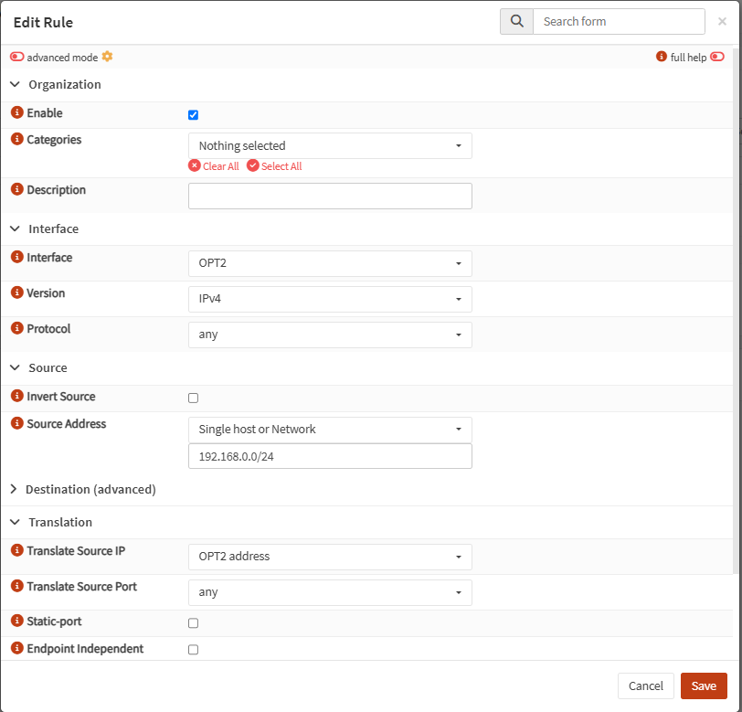

### 6.3. Kết quả mong đợi

| Egress WAN | Original Source | NAT Source |
|---|---|---|
| Primary - OPT2 | `192.168.0.0/24` | `61.14.236.2` |
| Backup - WAN | `192.168.0.0/24` | `103.141.177.33` |

---

## 7. Policy Based Routing trên OPT1

Traffic từ workload `192.168.0.0/24` đi vào OPNsense qua **OPT1**, vì vậy cần gắn Gateway Group vào firewall rule trên interface này.

Đi tới **Firewall → Rules → OPT1**.

```text
Interface   : OPT1
Quick       : Enabled
Action      : Pass
Direction   : In
Version     : IPv4
Protocol    : any

Source      : 192.168.0.0/24
Destination : any

State type  : keep state
Gateway     : GW_WAN_FAILOVER
```

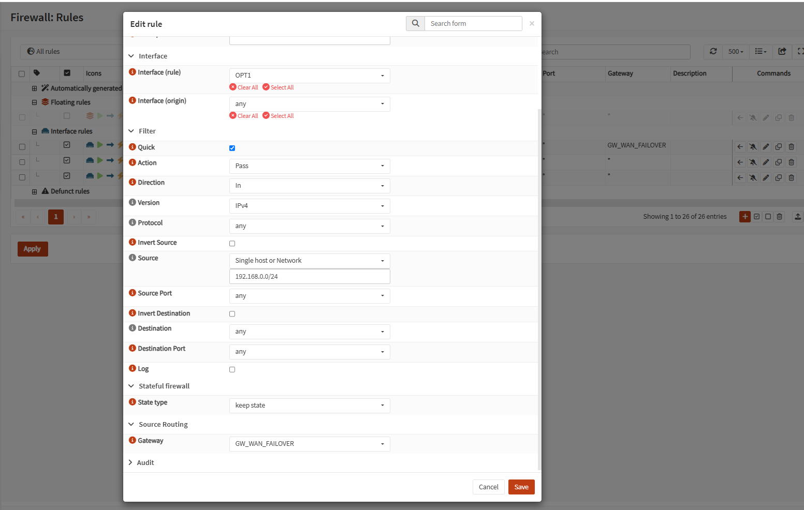

Sau khi Save, chọn **Apply**.

### Cơ chế PBR

```text
192.168.0.0/24
      |
      v
OPT1 / vmx0
      |
      v
Firewall Rule
Gateway = GW_WAN_FAILOVER
      |
      +--> Tier 1: OPT2_GW
      |
      +--> Tier 2: WAN_GW
```

Có thể kiểm tra rule PBR thực tế bằng:

```sh
pfctl -sr | grep '192.168.0.0/24'
```

Khi Primary đang được chọn, kết quả mong đợi có dạng:

```text
route-to (vmx2 61.14.236.1)
```

---

## 8. Kiểm tra trạng thái hoạt động

Sau khi hoàn tất Gateway, Gateway Group, Source NAT và PBR, kiểm tra default route:

```sh
netstat -rn4 | grep default
```

Khi `OPT2_GW` đang là Primary và hoạt động bình thường, kết quả mong đợi:

```text
default    61.14.236.1    UGS    vmx2
```

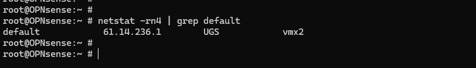

Kiểm tra PF policy-based routing:

```sh
pfctl -sr | grep '192.168.0.0/24'
```

Kết quả mong đợi khi Primary đang active:

```text
route-to (vmx2 61.14.236.1)
```

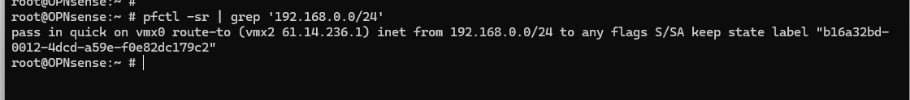

Hai kiểm tra này giúp xác nhận đồng thời:

```text
System default route -> Primary WAN
PF route-to          -> Primary WAN
```

---

## 9. Xử lý tình huống Failback không quay lại Primary

### 9.1. Hiện tượng

Trong một số lần kiểm thử, hệ thống có thể:

```text
Primary WAN down
      |
      v
Failover sang Backup WAN
      |
      v
Primary WAN up trở lại
      |
      v
Gateway/route chưa quay lại Primary như mong muốn
```

Phần này sử dụng **Gateway Status Monitor** để theo dõi `OPT2_GW` và hỗ trợ quá trình gateway recovery/failback.

> Nội dung monitor bên dưới được tổng hợp từ file `note.md` do người vận hành cung cấp. File gốc được giữ lại tại `docs/failback-monitor-note.md`.

---

## 10. Kiểm tra trạng thái Gateway bằng pluginctl

Command:

```sh
pluginctl -r return_gateways_status
```

Command trả về trạng thái Gateway mà OPNsense đang theo dõi thông qua `dpinger`.

Các field cần quan tâm:

| Field | Ý nghĩa |
|---|---|
| `name` | Tên Gateway trong OPNsense |
| `status` | Trạng thái Gateway |
| `monitor` | IP được `dpinger` sử dụng để kiểm tra |
| `gateway` | Gateway IP |
| `priority` | Priority của Gateway |
| `delay` | Latency |
| `loss` | Packet loss |
| `stddev` | Độ lệch chuẩn latency |

Trong mô hình này:

```text
OPT2_GW -> Priority 10 -> Primary
WAN_GW  -> Priority 20 -> Backup
```

Có thể dùng command này để kiểm tra nhanh trước khi xử lý failback.

---

## 11. Gateway Failback Monitor

### 11.1. Vị trí script

Script monitor được đặt tại:

```text
/usr/local/etc/monitor.sh
```

State file:

```text
/var/run/primary_gateway.state
```

Primary Gateway cần monitor:

```text
OPT2_GW
```

### 11.2. Logic monitor

Theo file note hiện tại, monitor hoạt động theo logic:

```text
Cron chạy monitor.sh
       |
       v
Đọc trạng thái OPT2_GW
       |
       v
Đọc state đã lưu
       |
       +--> State bình thường
       |        |
       |        +--> tiếp tục monitor
       |
       +--> State cũ = down
                |
                v
        Restart dpinger
                |
                v
             sleep 5
                |
                v
        dpinger probe lại Gateway
                |
                v
        Hỗ trợ quá trình failback
```

Mục tiêu của bước restart `dpinger` là buộc Gateway Monitor thực hiện probe lại trong trường hợp trạng thái `down` bị giữ/stale.

### 11.3. Script

> **Lưu ý:** file note được upload hiện chứa đoạn script đến bước `sleep 5`. README giữ nguyên phần logic được cung cấp và không tự bổ sung các thao tác thay đổi routing ngoài nội dung note.

```sh
#!/bin/sh

PRIMARY_GW="OPT2_GW"
STATE_FILE="/var/run/primary_gateway.state"

get_gw_status() {
    pluginctl -r return_gateways_status | awk -v gw="$PRIMARY_GW" '
        $0 ~ "\"" gw "\"" { found=1; next }
        found && /"status"/ {
            if ($0 ~ /down/) print "down"
            else             print "up"
            exit
        }
    '
}

# -- First run -----------------------------------------------------------------

if [ ! -f "$STATE_FILE" ]; then
    NEW_STATE=$(get_gw_status)
    echo "$NEW_STATE" > "$STATE_FILE"
    logger -t primary-gw-monitor "$PRIMARY_GW initial state: $NEW_STATE"
    exit 0
fi

OLD_STATE=$(cat "$STATE_FILE")

# -- When stored state is down: kick dpinger first, THEN read status -----------
# dpinger gets stuck reporting stale "down" until it is forced to re-probe

if [ "$OLD_STATE" = "down" ]; then
    logger -t primary-gw-monitor "$PRIMARY_GW is down, forcing dpinger re-probe..."

    pluginctl -s dpinger restart
    sleep 5   # give dpinger time to actually ping the gateway

    NEW_STATE=$(get_gw_status)

    if [ -z "$NEW_STATE" ]; then
        logger -t primary-gw-monitor "Unable to determine $PRIMARY_GW status after re-probe"
        exit 1
    fi

    if [ "$NEW_STATE" = "up" ]; then
        echo "up" > "$STATE_FILE"
        logger -t primary-gw-monitor "$PRIMARY_GW RECOVERED"
        configctl interface routes configure
        logger -t primary-gw-monitor "Triggered route reconfigure"
    else
        logger -t primary-gw-monitor "$PRIMARY_GW still down after re-probe"
    fi

    exit 0
fi

# -- When stored state is up: normal check (no kick needed) -------------------

NEW_STATE=$(get_gw_status)

if [ -z "$NEW_STATE" ]; then
    logger -t primary-gw-monitor "Unable to determine $PRIMARY_GW status"
    exit 1
fi

if [ "$NEW_STATE" = "down" ]; then
    echo "down" > "$STATE_FILE"
    logger -t primary-gw-monitor "$PRIMARY_GW DOWN"
fi

exit 0
```

Sau khi tạo/chỉnh script:

```sh
chmod 755 /usr/local/etc/monitor.sh
```

Kiểm tra syntax:

```sh
sh -n /usr/local/etc/monitor.sh
```

Nếu command không trả lỗi syntax thì có thể tiếp tục cấu hình action.

---

## 12. Tạo Action để Cron có thể chọn trên Web UI

OPNsense sử dụng action definitions tại:

```text
/usr/local/opnsense/service/conf/actions.d/
```

Tạo file:

```text
/usr/local/opnsense/service/conf/actions.d/actions_monitor.conf
```

Nội dung:

```ini
[run]
command:/usr/local/etc/monitor.sh
parameters:
type:script_output
message:Running primary gateway monitor
description:Primary Gateway Failback Monitor
```

Ý nghĩa:

```text
Action name/section : run
Command             : /usr/local/etc/monitor.sh
Description         : Primary Gateway Failback Monitor
```

Description này là tên cần tìm trong danh sách command khi tạo Cron trên Web UI.

> Nếu action mới chưa xuất hiện trong Cron UI, cần reload/restart backend action service theo quy trình vận hành của OPNsense rồi mở lại trang Cron.

---

## 13. Cấu hình Cron trên OPNsense Web UI

Đi tới:

**System → Settings → Cron**

Chọn **Add** và cấu hình job chạy định kỳ.

Khuyến nghị bắt đầu với chu kỳ:

```text
Minute      : *
Hour        : *
Day of month: *
Month       : *
Day of week : *
Command     : Primary Gateway Failback Monitor
Description : Monitor Primary Gateway for Failback
```

Tức monitor được gọi **mỗi phút một lần**.

> Cron được cấu hình trên UI thay vì chỉnh trực tiếp root crontab để dễ quản lý và kiểm tra trong quá trình vận hành.

Sau khi Save/Apply, kiểm tra lại danh sách Cron để xác nhận job đã được enable.
